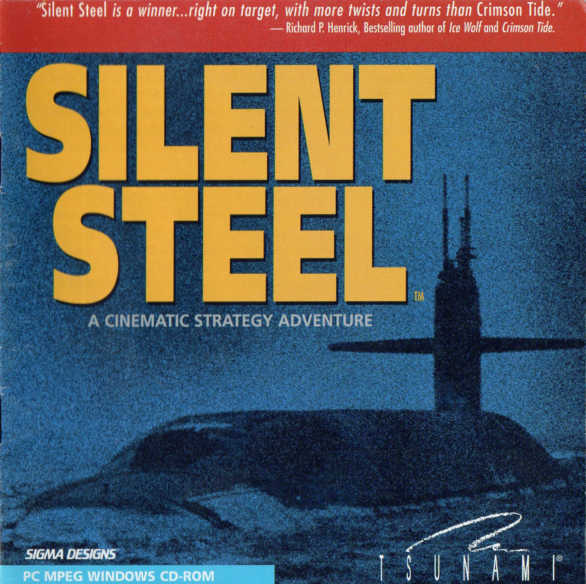

# Reverse Engineering Silent Steel

Silent Steel is a 1995 submarine simulator computer game by Tsunami Games. It was created during the influx of interactive movies during the 1990s. The game is composed almost entirely of live-action full motion video, with sparse computer-generated graphics depicting external shots of the boat during torpedo attacks and atmospheric fly-bys. More about *Silent Steel* is available on [Wikipedia](https://en.wikipedia.org/wiki/Silent_Steel), [MobyGames](https://www.mobygames.com/game/7993/silent-steel/) and the [ScummVM Wiki](https://wiki.scummvm.org/index.php/Silent_Steel). 

This project tries to reverse engineer the data files of the game and implement a barbone interpreter in python to play the game on modern machines (it was originally released as a 16bit executable for Win 3.11) and provide a basis to reimplement the game - for example in ScummVM.

## Status: WIP !!!

First few scenes are playable, but the story still skips sometimes.

## Compatibility:

At the moment this only supports the promotional disc available at the [Internet Archive](https://archive.org/details/silentsteeldisconepromotional).

## Requirements: 

Only **Python 3** and `ffplay` from **FFmpeg** should be required to run the game.