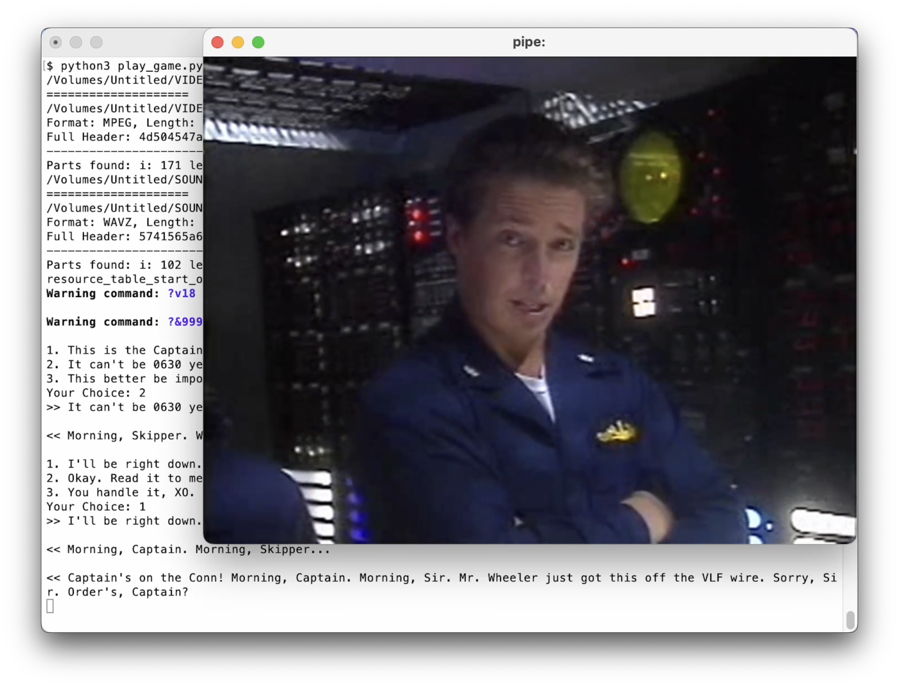

# Reverse Engineering Silent Steel

Silent Steel is a 1995 submarine simulator computer game by Tsunami Games. It was created during the influx of interactive movies during the 1990s. The game is composed almost entirely of live-action full motion video, with sparse computer-generated graphics depicting external shots of the boat during torpedo attacks and atmospheric fly-bys. More about _Silent Steel_ is available on [Wikipedia](https://en.wikipedia.org/wiki/Silent_Steel), [MobyGames](https://www.mobygames.com/game/7993/silent-steel/) and the [ScummVM Wiki](https://wiki.scummvm.org/index.php/Silent_Steel).

This project tries to reverse engineer the game files and implement a barebone interpreter in python to play the game on modern machines (it was originally released as a 16bit executable for Win 3.11) and provide documentation for a full re-implementation of the game (e.g. as a ScummVM engine).

## Status:

Much of the game is playable, but some parts of the game scripts are still not 100% understood or implemented. 

**[Watch the first 10min 🎬 on Youtube](https://youtu.be/tYT6yM3C5GM)**

For a full documentation of the data formats and other details, check out the writeup on my personal website: **[March 14, 2023: Reverse Engineering the 1995 FMV Game Silent Steel](https://christian.kuendig.info/posts/2023-03-silentsteel/)**.

## Compatibility:

At the moment this only supports the promotional disc available at the [Internet Archive](https://archive.org/details/silentsteeldisconepromotional) which is based on the Windows 3.1 MPEG release.

There were many releases of this game, it's not clear whether the later releases (AVI CD-ROM, DVD-ROM and DVD Video) were implemented the same way (DVD Video certainly wasn't).

## Requirements:

- **Python 3** with [nefile](https://github.com/npjg/nefile)
- `ffplay` from **FFmpeg**

## Instructions:

* Install requirements:
  * Your system will need python3 and ffplay (part of ffmpeg), make sure you have them installed
  * Install python requirements: `pip install -r requirements.txt`
* Mount promo disc `promo_disco.iso` (see link above)
* Run main script `play_game.py` and pass mount folder:
  * `python3 play_game.py /Volumes/Untitled`
  * When also passing `auto` the game is run in "demo mode" and skips asking for user input: `python3 play_game.py /Volumes/Untitled auto`